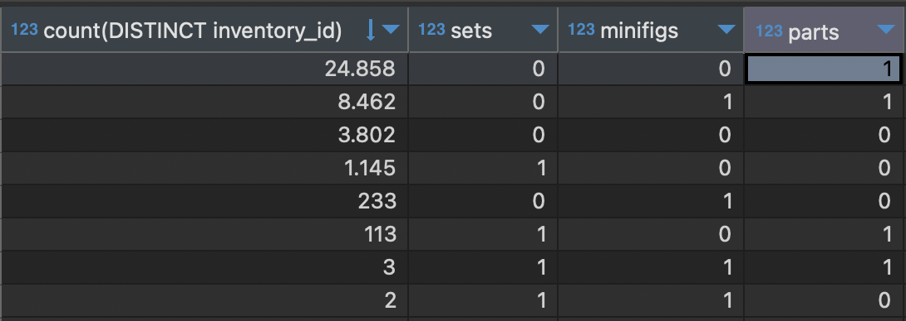
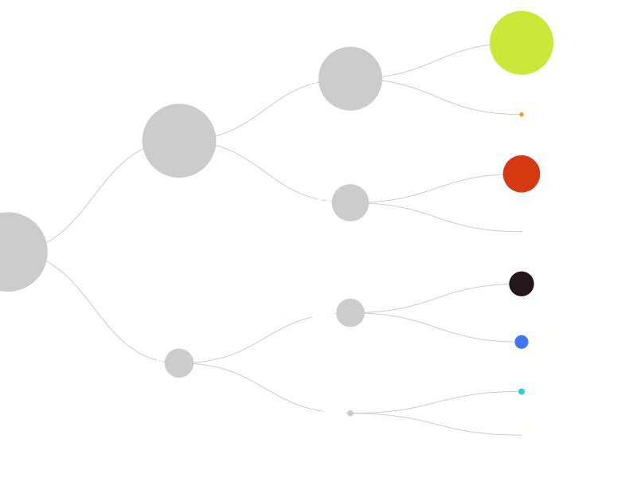
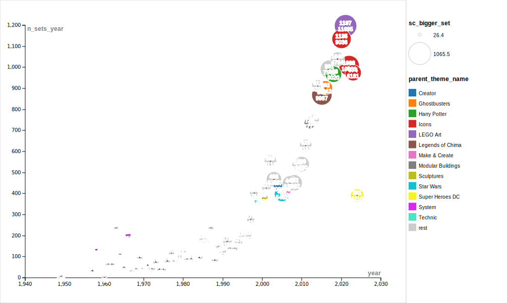
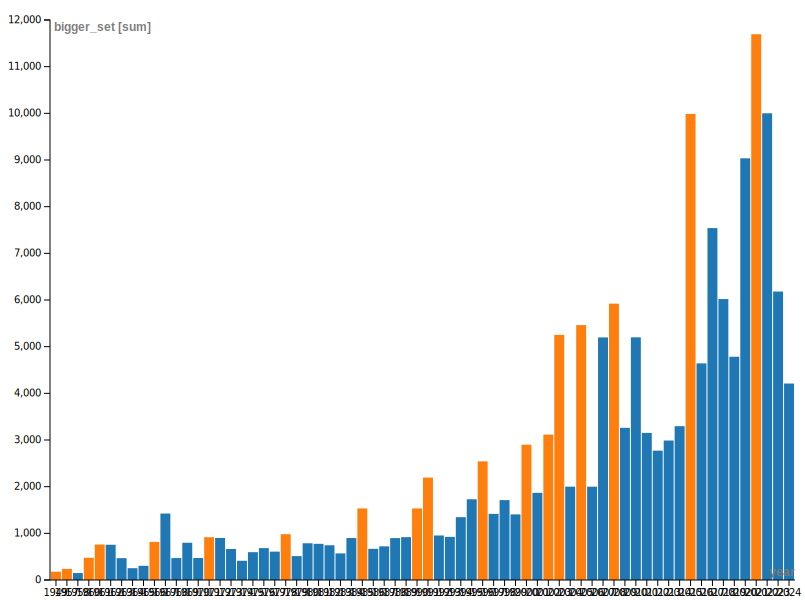
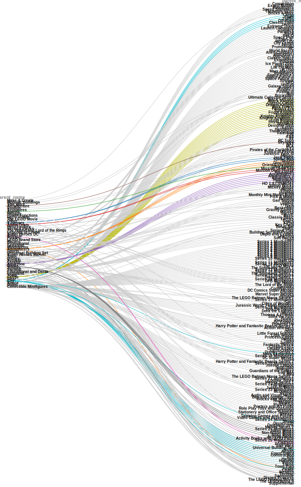
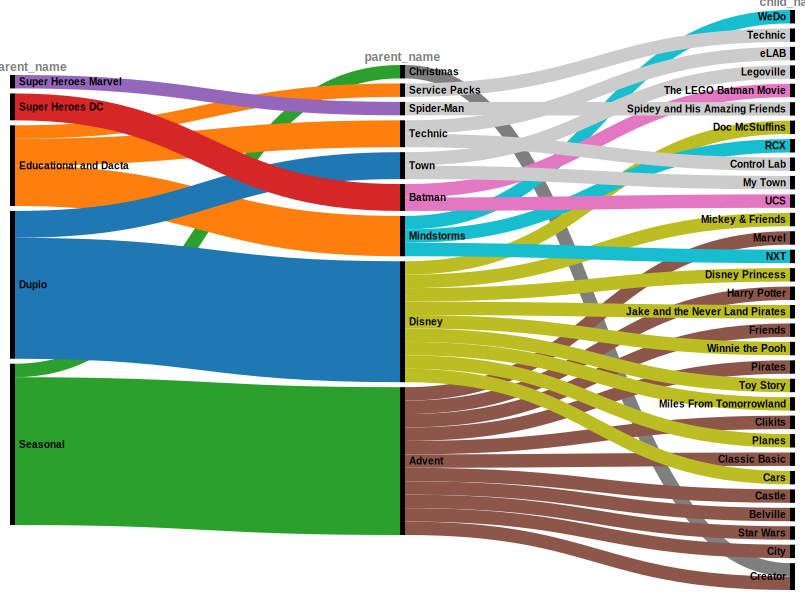

# lego
Data storytelling how-to from lego data.

## Data
We are going to create a relational database to store data from

[rebrickable](https://rebrickable.com/)

wich is an open source database about all sets of lego sold in the world from the beggining. You can finde all data stored in *csv files and they share the data model with the relationships between tables.


For this use case we are going to create an identical datamodel in duckDB database.

The files corresponding to ecah table are in the url

[rawDataRebrickable](https://rebrickable.com/downloads/)

and in this repository folder

```
legoDB/raw
```
### Database

The chosen database for this proyect is 

[duckDB](https://duckdb.org/)

and all the DDLs to crecreate the model are stored in this repository

```
legoDB/DDLs
```

## Hands on the model, understanding the tables

There is 1 table with the global inventory which contains a single row for each inventory item. This table relates to other three with the detail about the parts, the sets and the minifig.



Following the list in order of volume, there is a tree that clasifies the inventory items in 8 categories.



### Only sets

First study will focus only in sets.

The main table is sets_detailed.

### sets_and_bigger_by_year

Focusing in the kpi table about sets, the next query extracts the main information about volume of sets and volume of pieces by set over years.

>The size of the balls has been re-normalized to a 0-1000 scale using the function $y = 13 + 0.09x$

This is te query over the table to extract the csv file *data/sets_and_bigger_by_year.csv* 

```
select 
	year,
	n_sets_year,
	(13+0.09*bigger_set) as sc_bigger_set,
	bigger_set,
	case when n_sets_year_parent > 100
	then parent_theme_name 
	else 'rest' end as parent_theme_name 
from main.sets_kpis where version = max_version and num_parts = bigger_set and bigger_set >= 100;
```
and the subsequent figure *img/sets_and_bigger_by_year.svg*



Then I identified manually the permanente as the maxumum set *./data/sets_and_bigger_by_year_top_permanence*



### Only themes

First of all, I constructed the family tree of the themes. It came up with tthee levels of hierarchy, grandparents, parents, childs. The results are stored in the table *themes_family.tree.sql*





### Only colors

The table with all the information about the sets by year can be completed with the colors of all the pieces present in the sets not counting the spare ones. Better perform a cumsum over the years.
It is also needed to have the tags of the colors to plot them in flourish.

When creating the table, it is important to fill every color every year with zeros to avoid inconvenient jumps in the table.

*cumsum_colors_by_year.sql*

*flourish_colors.sql*

<div class="flourish-embed flourish-scatter" data-src="visualisation/17788055"><script src="https://public.flourish.studio/resources/embed.js"></script></div>


